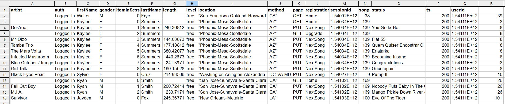

# Project 2 : Data Modeling with Apache Cassandra

## Overview

A startup called Sparkify wants to analyze the data they've been collecting on songs and user activity on their new music streaming app. The data collected is stored in CSV files and the analytics team is interested in understanding what songs users are listening to. 

The goal of this project is to create an Apache Cassandra database schema and ETL pipeline to run queries for song play analysis.

## Dataset

The dataset is ```event_data``` which is a directory of CSV files partitioned by date.
Filepath of individual CSV files follow a format ```event_data/<yyyy>-<mm>-<dd>-events.csv``` wherein ```yyyy```,```mm```,```dd``` refers to the year, month and day of the event respectively.
Sample file as given below:



## Design
Since Apache Cassandra is a NoSQL database, the data tables are modeled based on the queries to be run. The three queries on which data tables are modeled on are as given below.

1. Get the artist, song title and song's length in the music app history that was heard during sessionId = 338, and itemInSession = 4
```SELECT artist, song_title, song_length from session_library WHERE sessionId = 338 and itemInSession = 4```

2. Get the name of artist, song (sorted by itemInSession) and user (first and last name) for userid = 10, sessionid = 182
```SELECT artist, song, firstname, lastname from user_activity WHERE sessionId = 182 and userid = 10```

3. Get every user name (first and last) in my music app history who listened to the song 'All Hands Against His Own'
```SELECT firstname, lastname from user_library WHERE song='All Hands Against His Own' ```


## Project Files

`Project_1B_ Project_Template.ipynb` : Jupyter notebook that contains code to create and load the data tables.

`event_datafile_new.csv` : smaller event data csv file that will be used to insert data into the Apache Cassandra tables.

`README.md` : Markdown file that gives a summary of the project.

`images` : directory containing screenshots of `event_datafile_new.csv` and sample data from a csv file in event_data directory.


## Execution Instructions

Launch and run `Project_1B_ Project_Template.ipynb` to create and load the Apache Cassandra database and validate the data inserted.


