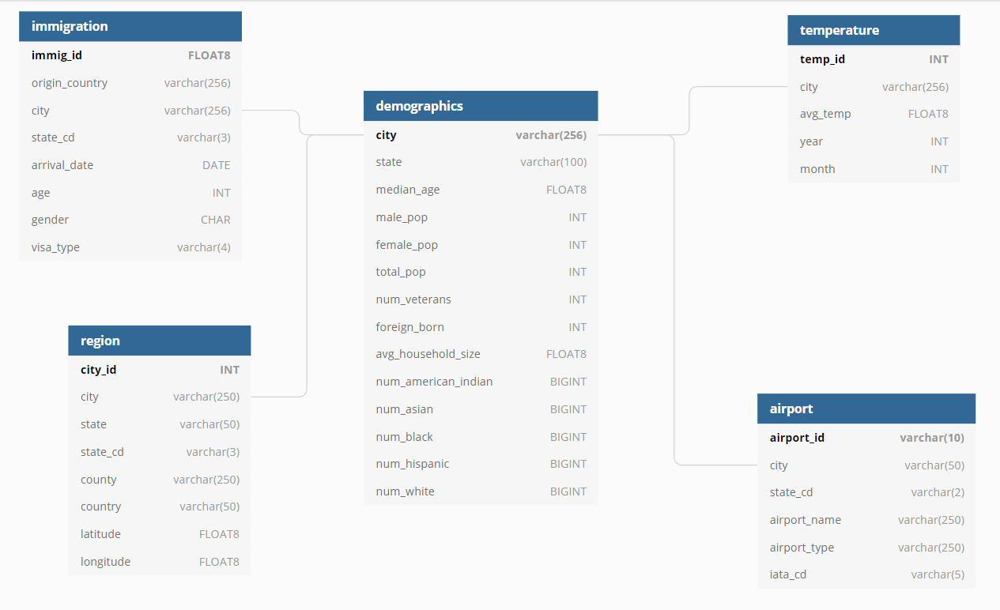
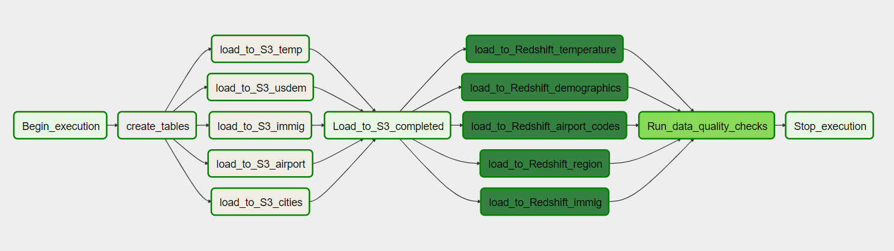

# Capstone Project : US Cities

## Overview

The US is home to some of the most popular and powerful cities in the world. People flock to these cities for tourism, work, and whatnot. In this project, we will analyze different cities in the US including whether temperature and immigration are affected by the city demography. Data about airports and city location is used to supplement the analysis.

## Scope the Project and Gather Data
### Scope
The goal of this project is to create high grade Airflow data pipelines that processes the data residinng in local files using spark and loads them to a staging area in Amazon S3 and further loads the data into the analytics tables in Amazon Redshift. Data quality plays a big part when analyses are executed on top of the data warehouse and tests are to be run against the datasets after the ETL steps have been executed to catch any discrepancies in the datasets.

### Datasets
**1. U.S. City Demographic Data:** This data comes from OpenSoft. It is in CSV format and contains information about different US cities like population and income. The data can be found in this [link](https://public.opendatasoft.com/explore/dataset/us-cities-demographics/export/).

**2. I94 Immigration Data:** This data comes from the US National Tourism and Trade Office and contains records of International Travel to the United States. The data is stored as sas7bdat files. Details of the data can be found [here](https://travel.trade.gov/research/reports/i94/historical/2016.html).

**3. World Temperature Data:** This dataset came from Kaggle. It is in CSV format and holds data about cities of the world and their monthly  temperatures. The dataset can be accessed [here](https://www.kaggle.com/berkeleyearth/climate-change-earth-surface-temperature-data).

**4. Airport Code Table:** This table comes from Datahub. It is a simple table of airport codes and corresponding cities in CSV format. This table can be found in this [link](https://datahub.io/core/airport-codes#data).

**5. US City Data:** This data comes from simplemaps. It is in CSV format and has detailed information on US cities like county, state and so on. It can be found at this [link](https://simplemaps.com/data/us-cities).

**6. I94 Port City Codes:** We derive this data from the data dictionary **I94_SAS_Labels_Descriptions.SAS** associated with **I94 Immigration Data**
using the `i94port` column. This is used to get arrival city details in Immigration Data.

**7. I94 Res Country Codes:** We derive this data from the data dictionary **I94_SAS_Labels_Descriptions.SAS** associated with **I94 Immigration Data**
using the `i94res` column. This is used to get the country which the traveler departed from in the Immigration Data.

## Explore and Assess the Data

Spark is being used to read and transform the data as it is easy to use and is well-suited to handle the data requirements. It has the ability to read different formats such as `.sas7bdat` and `.csv`. The data is loaded into spark dataframes and SparkSQL is used to write the data into Amazon S3 as parquet files. Spark supports libraries that can connect to Amazon S3 directly.

**Data cleansing:**
1. Checked data for null or missing values and removed them.
2. Dropped duplicate records
3. Converted into appropriate data types
4. Pivoted rows to columns when necessary

## Define the Data Model

### Conceptual Data Model

Data derived from the datasets are loaded into the tables `demographics`,`immigration`,`temperature`,`airport` and `region`.

demographics table is considered the central table as it holds data about a US city and its population. It can be joined with immigration table to analyse the international movement of people to US cities. Combining this data with temperature data should provide further insights. Airport and region tables supports the other tables to provide answers to critical questions.

### Steps to pipeline the data into the data model
1. Load the data from different datasets to spark dataframes
2. Clean the data from different sources to handle nulls, duplicates, data types, etc
3. Combine with necessary supporting datasets to obtain meaningful information.
4. Use SparkSQL to capture the necessary data and write the transformed data into parquet files in S3
5. Create the final tables in Redshift and load the data from S3 files to these tables

## Run ETL to Model the Data

### Environment
* Apache Airflow
* Apache Spark
* Amazon S3
* Amazon Redshift
* Python

### Project Files

1. `capstone_dag.py`: This file contains the code of the main DAG including all the imports, tasks and task dependencies.

2. `capstone_create_tables.sql`: contains the SQL scripts to create the final tables in Redshift.

3. `etl_cities.py`,`etl_airportcodes.py`,`etl_demog.py`,`etl_immig.py`,`etl_temp.py` : These files are the individual pyspark scripts to load, transform and stage the data to Amazon S3 for the respective datasets. These are executed using `BashOperator` in the DAG.

   **Note:** Change the `bash_command` to reflect the correct path of the respective .py script before DAG execution.

4. `copy_redshift.py`: holds the `CopyToRedshiftOperator` which copies data in S3 parquet files to Redshift tables.

5. `data_quality.py`: Contains code for the `DataQualityOperator` which checks the final tables in Redshift for NULL values and the count of records of the loaded data.

6. `capstone_sql_queries.py`: Supports the `DataQualityOperator` by providing it with SQL queries to check for NULL values.

### Prerequisites
1. AWS Access Key ID and AWS Secret Access Key
2. Amazon S3 bucket for staging parquet files
3. Amazon Redshift cluster for the analytics tables

### Execution Instructions

1. Run `/opt/airflow/start.sh` command to start the Airflow web server.

2. Configure Airflow Connections and Variables set as below:
    * Connections
    
        `aws_credentials` set with AWS credentials
        
        `redshift` set with Redshift cluster details
        
    * Variables
    
        `INPUT` set as the common file path of the input files
        
        `OUT` set as the S3 staging folder path
        
        `S3_bucket` set as the name of S3 bucket. eg:udacity-dend
        
        `S3_key` set as the subfolder name in S3 bucket. eg: song_data
        
        
3. Change the `bash_command` to reflect the correct path of the respective .py script before DAG execution.

4. Uncomment the code after the imports in the DAG to get the variables S3_bucket and S3_key.

5. Run the DAG through the Airflow UI.

### DAG diagram

## Project Write Up

Spark is being used to read and transform the data as it is easy to use and is well-suited to handle the data requirements. It has the ability to process large amounts of data and read different formats such as `.sas7bdat`,`.csv` and `parquet`. The data is loaded into spark dataframes and SparkSQL is used to write the data into Amazon S3 as parquet files. Spark supports libraries that can connect to Amazon S3 directly.
Airflow is used for easy execution, scheduling and automation of the ETL pipeline. It can also integrate easiy with S3 and Redshift.

**Frequency of data updation**

Demographics data will be the least frequently updated data, say yearly, due to the unfeasibility of getting the data more often. Immigration and temperature data can be updated monthly or more often, if necessary. Airport and city data may be updated yearly or less frequently as new data(new aiports/cities) are not likely to be built commonly. 

Approach to the problem under the following scenarios:

If the data was increased by 100x: The current setup (Spark and Redshift) should be able to handle this scenario easily by adding more worker nodes when necessary.

If the data populates a dashboard that must be updated on a daily basis by 7am every day: Airflow is currently set to run monthly. This can be updated to run daily to handle this scenario.

If the database needed to be accessed by 100+ people: Redshift should be able to easily do this and can be scaled if required. 

